# ?? Lemoo ? Community-Powered E-Commerce Platform

> A modern, microservices-based e-commerce platform that combines seamless online shopping with rich social interaction, AI-powered search, and real-time community features.

---

## ? Table of Contents

- [Overview](#overview)
- [Key Features](#key-features)
- [Tech Stack](#tech-stack)
- [System Architecture](#system-architecture)
  - [High-Level Design](#high-level-design)
  - [Authentication & Authorization](#authentication--authorization)
  - [Store Registration Flow](#store-registration-flow)
  - [Product Lifecycle](#product-lifecycle)
  - [Order Processing & Saga Pattern](#order-processing--saga-pattern)
  - [Distributed Locking for Inventory & Promotions](#distributed-locking-for-inventory--promotions)
  - [Real-Time Chat System](#real-time-chat-system)
  - [AI Search & Chat System](#ai-search--chat-system)
  - [CI/CD Pipeline](#cicd-pipeline)
- [Screenshots](#screenshots)
- [Getting Started](#getting-started)
- [Contributing](#contributing)
- [License](#license)

---

## Overview

Lemoo is a full-featured e-commerce ecosystem built from the ground up on a **microservices architecture**, designed to handle massive scale while delivering a personalized, community-driven shopping experience.

Unlike traditional e-commerce platforms that focus purely on transactions, Lemoo blends **social commerce** into the core product ? users can connect as friends, share vouchers, chat in real-time, and get AI-powered shopping recommendations, all within a single integrated ecosystem.

---

## Key Features

### ? Shopping
- Personalized product recommendations
- Shopping cart management
- Voucher collection and redemption
- Order placement and real-time order tracking (pending ? processing ? shipping ? delivered)

### ? AI-Powered Search
- **Natural language search**: describe what you're looking for in plain Vietnamese or English
- **Semantic vector search** using Google Text-Embedding-004 + Qdrant
- Traditional keyword search with filtering

### ? AI Shopping Assistant
- Integrated LLM chatbot (Gemini 2.0 Flash) for personalized shopping advice
- Budget-based product planning (e.g. *"I have 2 million VND, what massage chair should I buy?"*)
- Order tracking and voucher management via natural language
- Built on the **Model Context Protocol (MCP)** for structured tool-calling into backend services

### ? Community & Social
- Real-time 1-on-1 and group messaging
- Friend discovery and requests
- Voucher sharing between friends
- Notification center for order and product events

### ? Seller Tools (Lemoo Seller Center)
- Product creation with variant management (SKU, size, color, images)
- Inventory and pricing management
- Promotion/voucher campaign creation
- Order fulfillment and shipping status management
- AI-assisted product listing evaluation (auto-moderation)

### ?? Admin
- Store approval workflow (approve / reject with notifications)
- Product moderation (manual + AI-assisted auto-approval)
- System monitoring via Kubernetes Dashboard, Kafka UI, Redis Insight

---

## Tech Stack

### Backend
| Layer | Technology |
|---|---|
| Microservices Framework | Spring Boot, Spring Cloud, Spring Security |
| Service Discovery | Spring Cloud Eureka |
| API Gateway | Spring Cloud Gateway |
| AI Integration | Spring AI, LangChain, LangGraph |
| MCP Protocol | Spring MCP Server, Spring MCP Client |
| Authentication | OAuth 2.0, JWT |

### Frontend
| Layer | Technology |
|---|---|
| UI Framework | ReactJS |
| Data Fetching | TanStack Query |
| Routing | TanStack Router |

### Data & Messaging
| Purpose | Technology |
|---|---|
| Relational Data | PostgreSQL |
| Document Data | MongoDB |
| Distributed Cache & Locks | Redis (Redisson) |
| Vector Database | Qdrant |
| Message Broker | Apache Kafka |

### AI & ML
| Purpose | Technology |
|---|---|
| LLM (Chat & Evaluation) | Gemini 2.0 Flash |
| Text Embeddings | Google Text-Embedding-004 |
| Agent Framework | LangChain + LangGraph |

### Infrastructure & DevOps
| Purpose | Technology |
|---|---|
| Containerization | Docker |
| Orchestration | Kubernetes (K8s) |
| Cloud Provider | Google Cloud Platform (GCP) |
| CI/CD | GitHub Actions |
| Monitoring | K8s Dashboard, Kafka UI, Redis Insight |

---

## System Architecture

### High-Level Design

The Lemoo ecosystem is divided into three primary layers: the **Client Layer**, the **Microservices Layer** (orchestrated on Kubernetes), and the **Data Layer**.

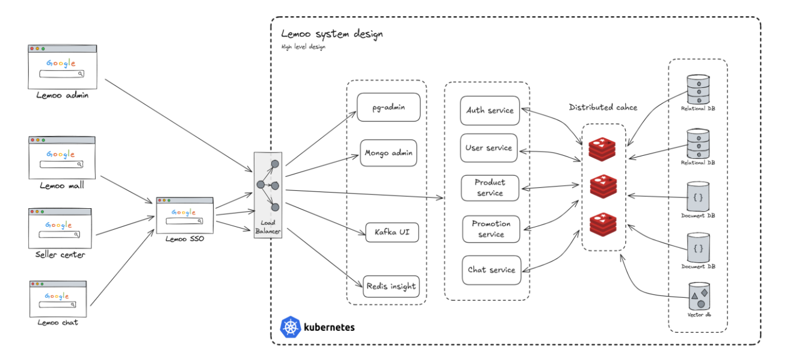

**Client Applications:**
- **Lemoo Mall** ? buyer-facing storefront with search, cart, and order tracking
- **Lemoo Chat** ? social layer: friends, direct messaging, voucher sharing, AI chat
- **Lemoo Seller Center** ? seller dashboard for product, order, promotion management
- **Lemoo Admin** ? back-office for store/product approval and system monitoring

**Lemoo SSO** provides single sign-on across all four apps via OAuth 2.0, so users authenticate once and move freely between surfaces.

---

### Authentication & Authorization

The authentication system uses a **token-based, gateway-enforced** model:

1. **Login via SSO** ? Auth Service validates credentials ? issues JWT access token
2. **Every API request** passes through the **API Gateway**, which validates the token
3. If the token is missing or invalid ? `HTTP 401 Unauthorized`
4. Internal resource services call Auth Service's `/auth/internal/token_key` endpoint to decode the token and extract the user's roles
5. If the user lacks required permissions ? `HTTP 403 Forbidden`

<!-- INSERT: H�nh 3.2 - S? ?? ??ng nh?p qua SSO v� Auth Service -->
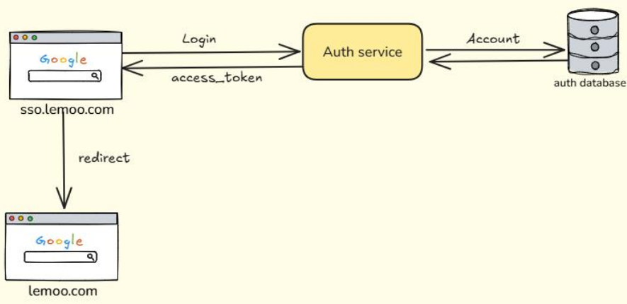

<!-- INSERT: H�nh 3.3 - S? ?? x�c th?c token trong h? th?ng ph�n t�n -->

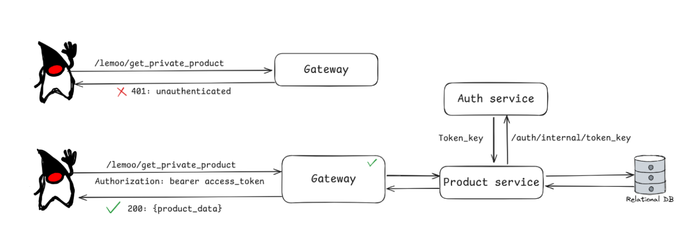

This design means **no service trusts the client directly** ? all authorization is verified internally, ensuring clean separation of concerns and a strong security posture.

---

### Store Registration Flow

Becoming a seller on Lemoo goes through a structured approval pipeline:

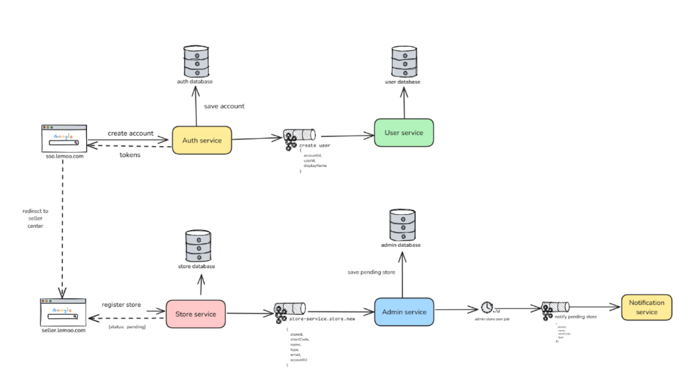

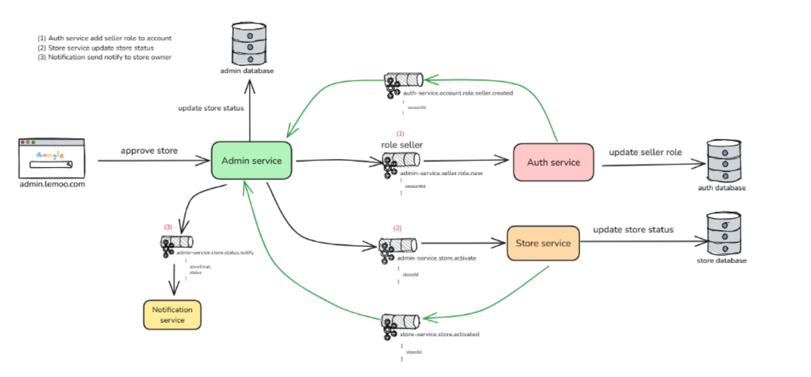

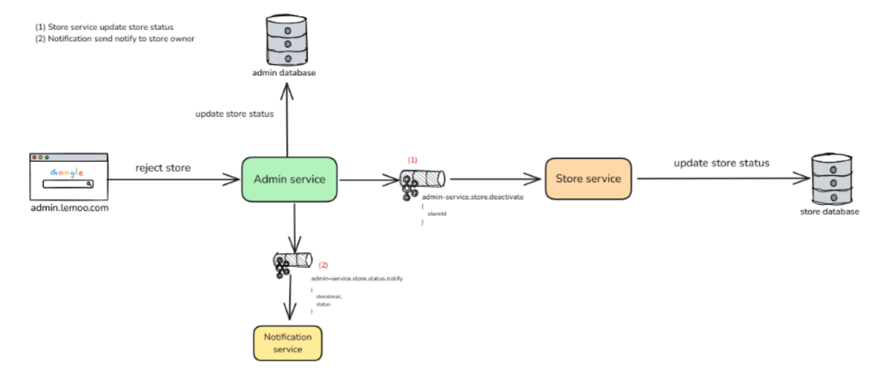

---

### Product Lifecycle

When a seller creates a product, it goes through a multi-stage asynchronous pipeline before becoming visible to buyers:

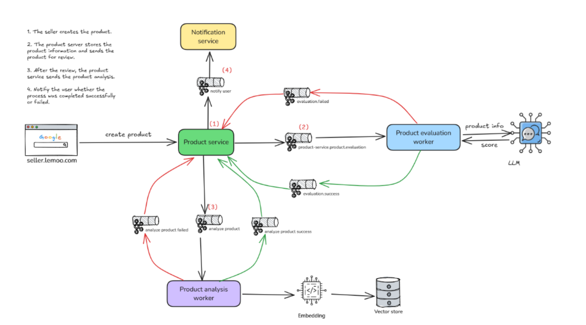

**Key design decisions:**
- LLM-based auto-moderation reduces admin workload significantly
- Vector embeddings are generated at creation time, so AI search is always up-to-date
- All steps are fully decoupled via Kafka ? Product Service never blocks on evaluation

---

### Order Processing & Saga Pattern

Order processing is the most complex workflow in Lemoo, coordinating multiple services with strict consistency requirements. It uses the **Saga Orchestration Pattern** with `Order Service` as the central orchestrator.

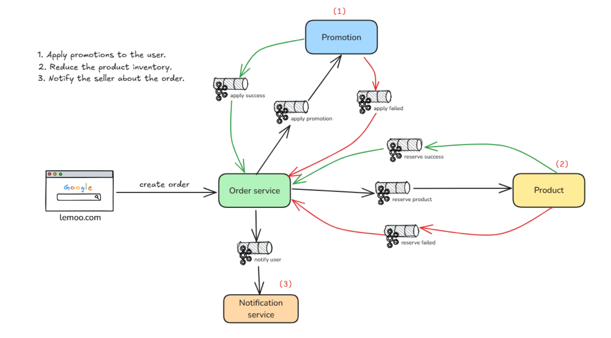

**Why Saga over 2PC?**

Traditional two-phase commit (2PC) requires global resource locks across services ? this kills throughput at scale. Saga breaks the transaction into local transactions per service, with **compensating transactions** that roll back only what's needed if a step fails. Combined with Kafka as the event bus, this approach supports 10 million orders per minute without bottlenecks.

---

### Distributed Locking for Inventory & Promotions

In high-concurrency scenarios, multiple order requests may target the same product SKU or promotion code simultaneously. Without synchronization, this leads to:

- **Race conditions** ? two requests both read stock = 1, both proceed, stock goes to -1
- **Overselling** ? more units sold than available
- **Promotion overuse** ? voucher used more times than its configured limit

Lemoo solves this using **Redis distributed locks via Redisson**:

<!-- INSERT: H�nh 3.9 - ?nh minh h?a c? ch? kh�a ph�n t�n -->
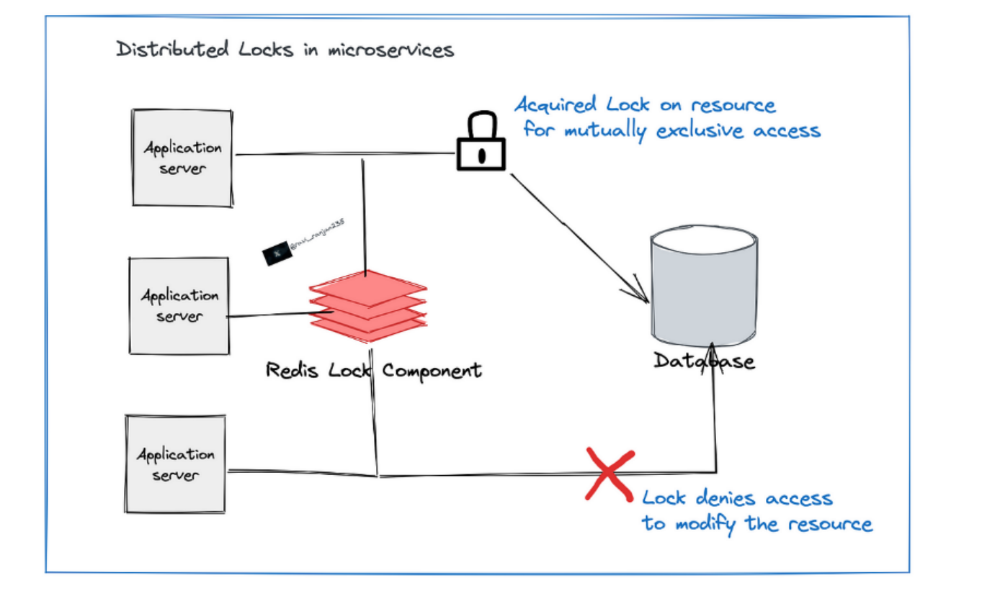

**Inventory lock key**: `lock:product:<productId>`
**Promotion lock key**: `lock:promotion:<promotionId>`

Redis also serves as a **distributed cache layer** (via Redis Cluster) for frequently accessed data like product listings, voucher metadata, and session state ? significantly reducing load on PostgreSQL and MongoDB.

---

### Real-Time Chat System

The chat system is built on **WebSocket + Kafka** to achieve low-latency message delivery at scale:

<!-- INSERT: H�nh 3.10 - S? ?? thi?t k? h? th?ng chat realtime v?i socket -->
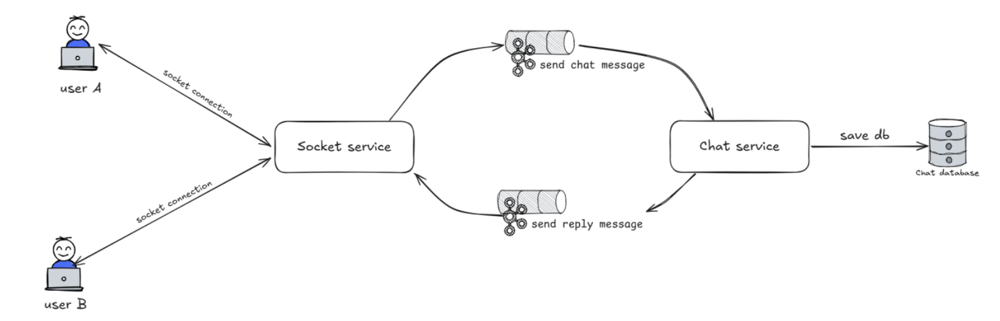

**Design choices:**
- **MongoDB** is used for chat storage ? its flexible document model and high write throughput fit chat history perfectly
- **Kafka** decouples the Socket Service from Chat Service, allowing each to scale independently
- Target message delivery latency: **< 100ms** under high load

---

### AI Search & Chat System

The AI layer uses **Model Context Protocol (MCP)** to give the LLM structured, real-time access to backend data without tight coupling.

**Three MCP Servers:**

| MCP Server | Connected Service | Example Queries |
|---|---|---|
| Product MCP Server | Product Service + Qdrant | "Find me a blue t-shirt under 300k" |
| Order MCP Server | Order Service | "Where is my order?" |
| Voucher MCP Server | Promotion Service | "Do I have any vouchers for this shop?" |

<!-- INSERT: H�nh 3.11 - H? th?ng AI chat s? d?ng MCP server -->
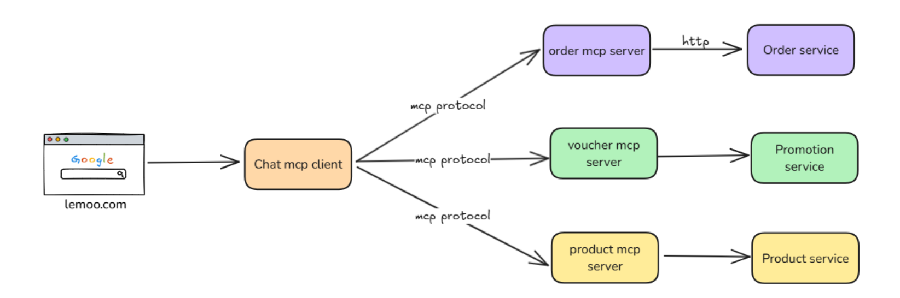

This architecture means the AI can answer complex, multi-step queries like:

> *"I have 2 million VND. What's the best massage chair I can buy right now, and do I have any vouchers I can apply?"*

The LLM will call the Product MCP Server to find matching products, then call the Voucher MCP Server to check applicable vouchers, and synthesize a complete answer.

---

### CI/CD Pipeline

Every push to the main branch triggers an automated GitHub Actions pipeline:

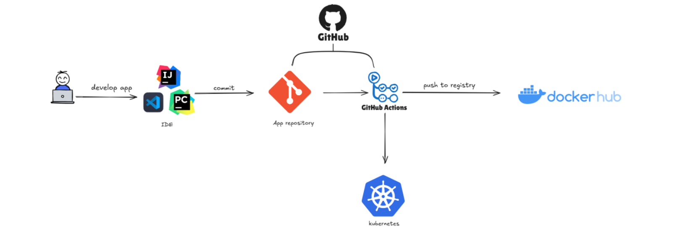

<!-- INSERT: H�nh 3.12 - Quy tr�nh CI/CD v?i Github Actions v� Kubernetes -->

<!-- INSERT: H�nh 4.7 - Giao di?n qu?n l� CI qua Github Actions -->

---

## Screenshots

### Authentication

| Login                               | Register                               |
|-------------------------------------|----------------------------------------|
| 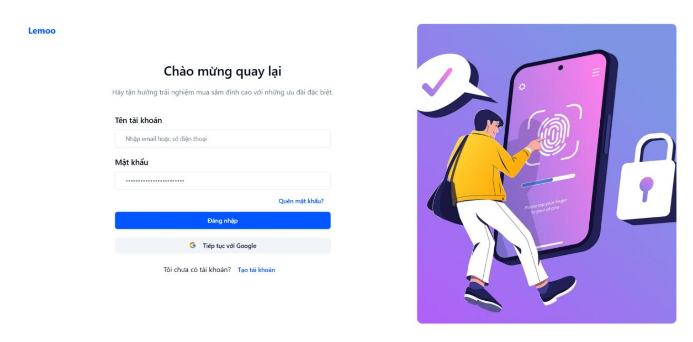 | 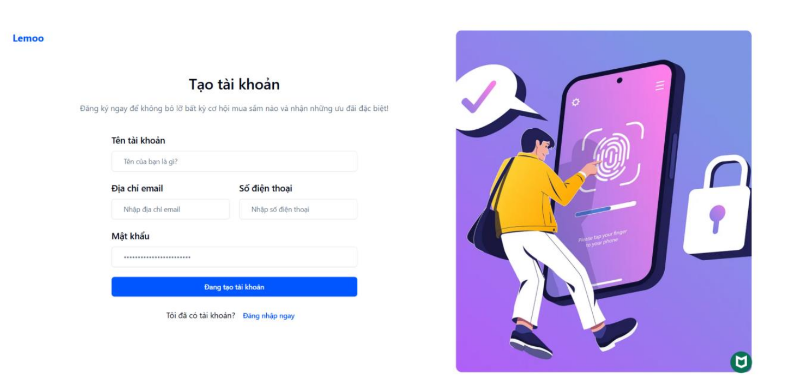 |

---

### Lemoo Mall

**Homepage**

<!-- INSERT: H�nh 4.10 - Giao di?n trang ch? Lemoo Mall -->
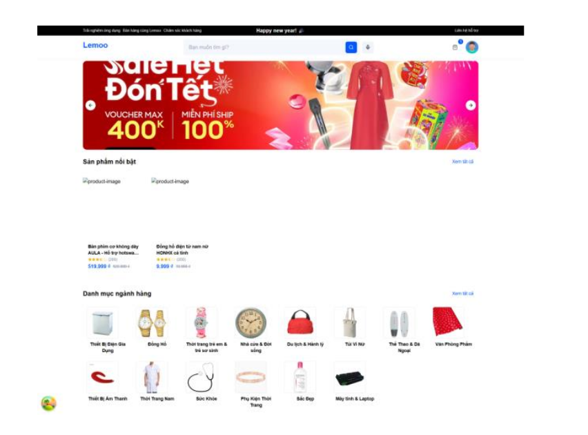
---

**Product Detail Page**

<!-- INSERT: H�nh 4.12 - Giao di?n chi ti?t s?n ph?m -->
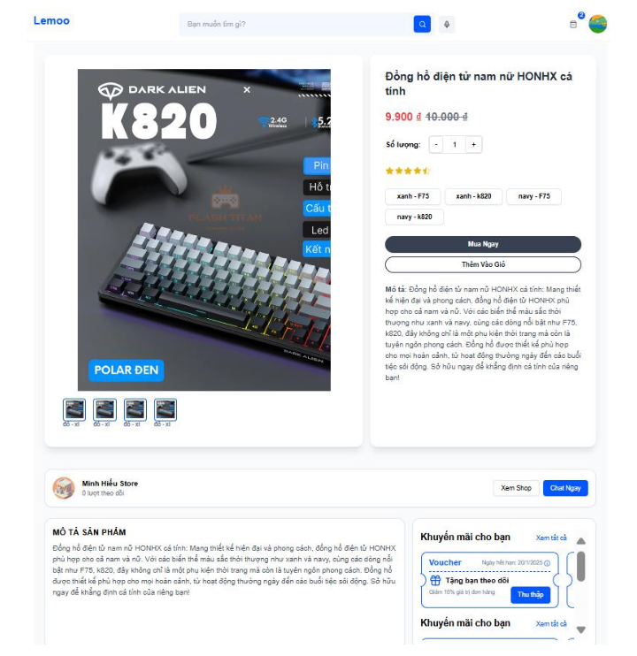
---

### AI Chat Assistant

<!-- INSERT: H�nh 4.11 - Giao di?n chat AI -->
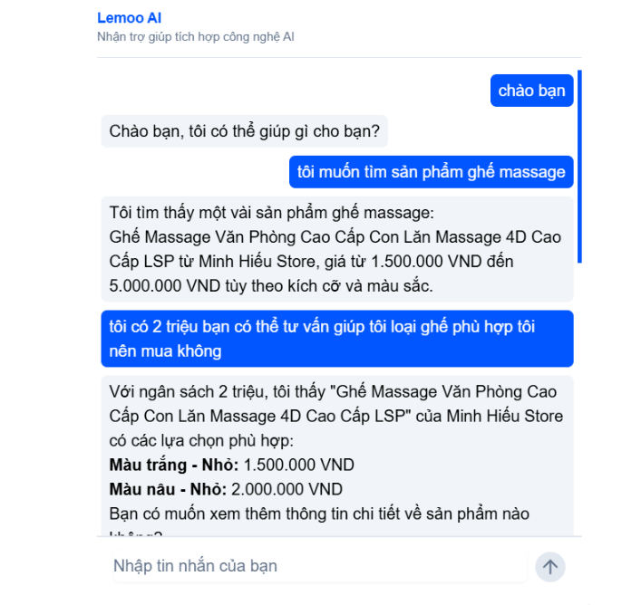
*Example conversation: User asks for a massage chair recommendation within budget ? the AI searches the platform, finds matching products, and suggests the best fit.*

---

### Order Management

| Shopping Cart                      | Checkout                                  |
|------------------------------------|-------------------------------------------|
| 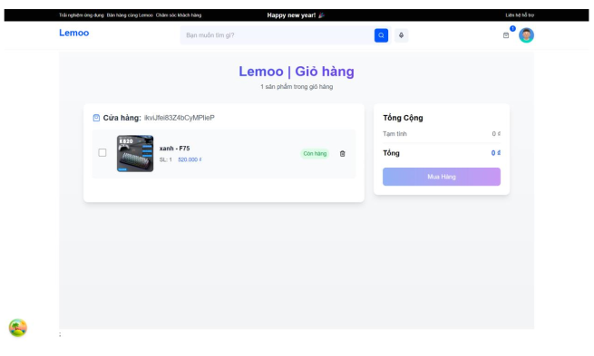 | 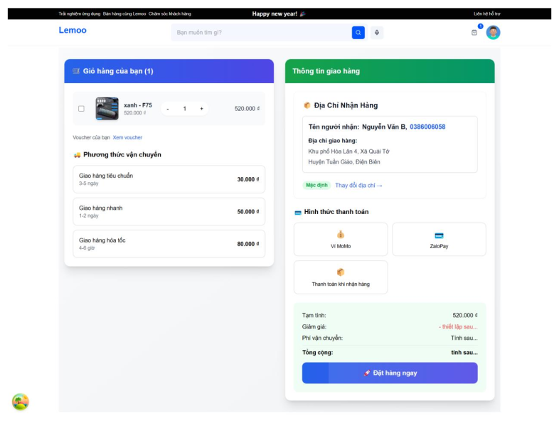 |

| Order List                          | Order Tracking                               |
|-------------------------------------|----------------------------------------------|
| 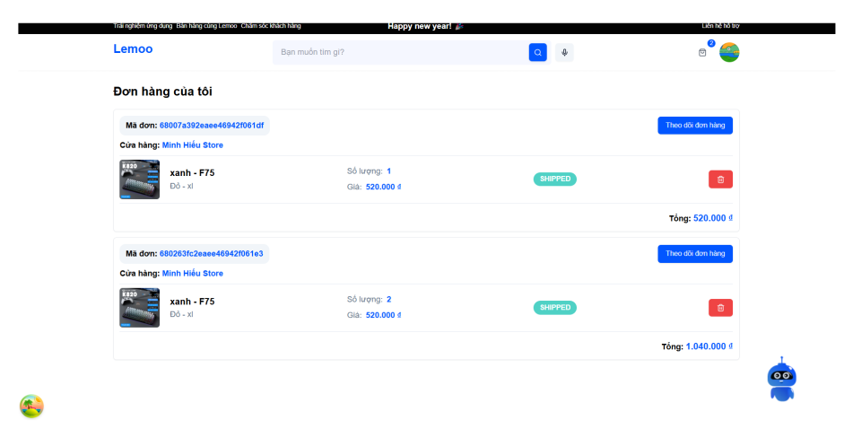 | 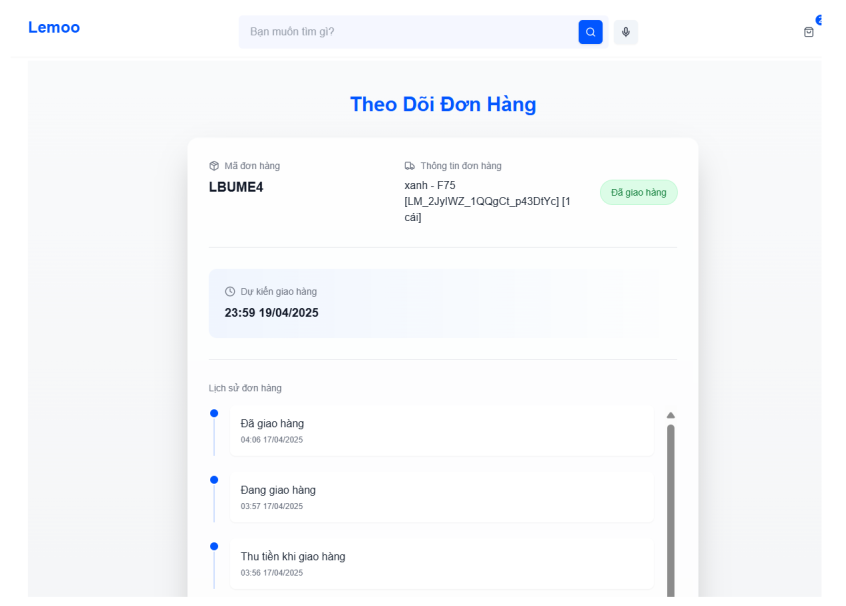 |

---

### Lemoo Seller Center

| Create Product                                        | Manage Products                                         |
|-------------------------------------------------------|---------------------------------------------------------|
| 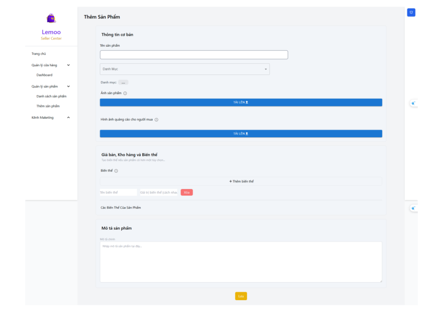 | 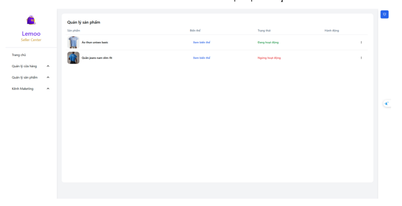 |

| Promotions Dashboard                                | Create Promotion |
|-----------------------------------------------------|---|
| 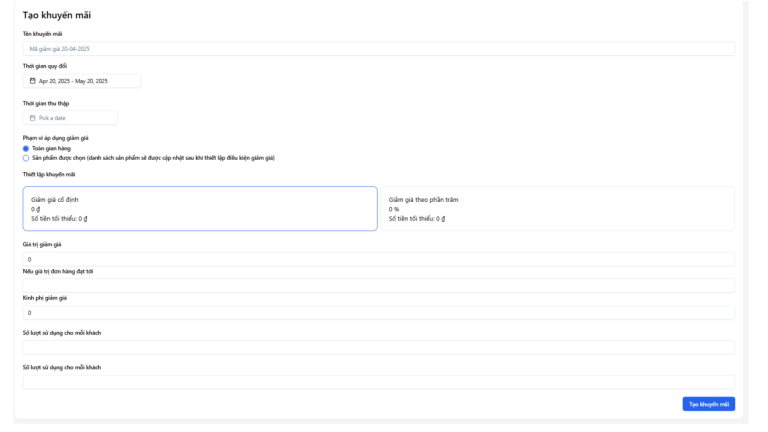 | 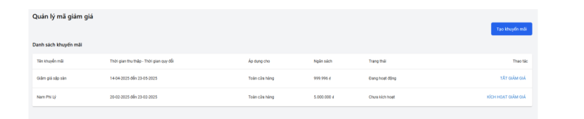 |

**Store Registration**

<!-- INSERT: H�nh 4.18 - Giao di?n ??ng k� b�n h�ng -->
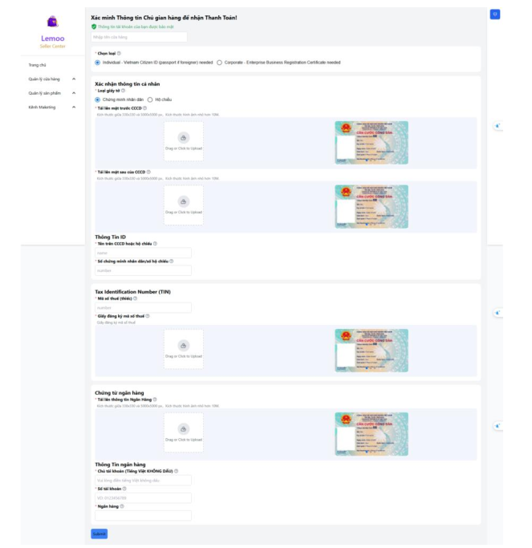
---

### Community Features

| Friend Suggestions                            | Friend Requests                                   |
|-----------------------------------------------|---------------------------------------------------|
| 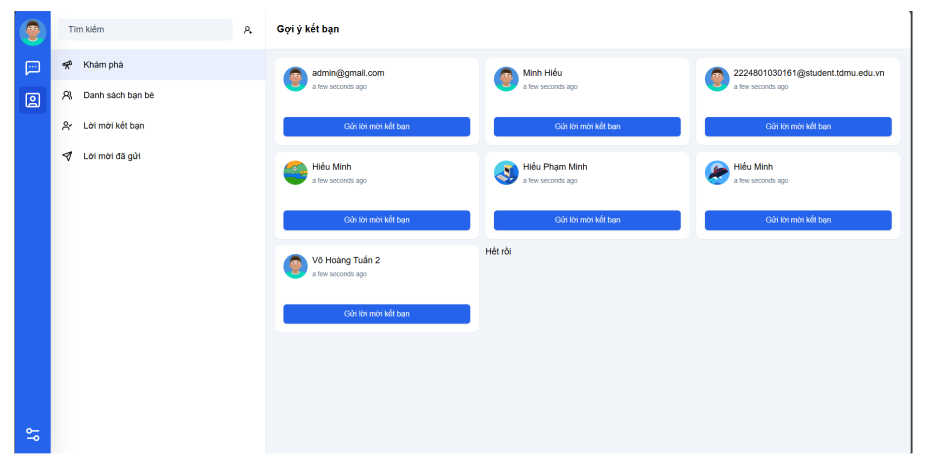 | 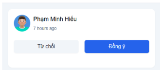 |

**Real-Time Chat**

<!-- INSERT: H�nh 4.26 - Giao di?n chat -->
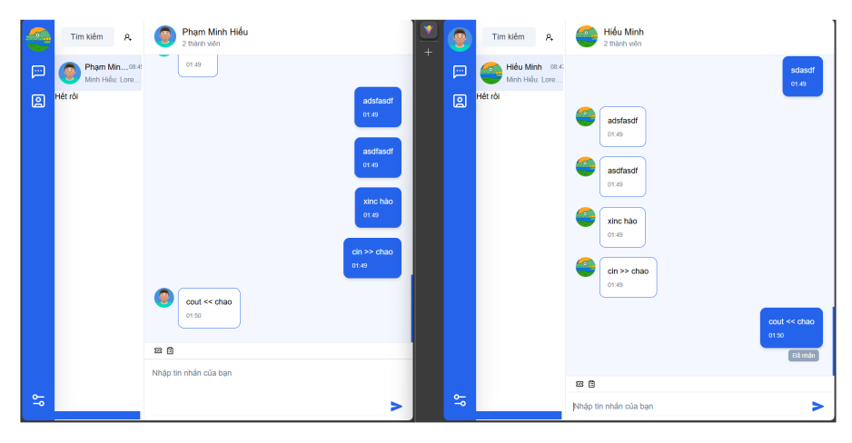
**Notification Center**

<!-- INSERT: H�nh 4.23 - Giao di?n trung t�m th�ng b�o -->

---

### Infrastructure

| GCP VPS Nodes | Kubernetes Node  |
|---|---|
| 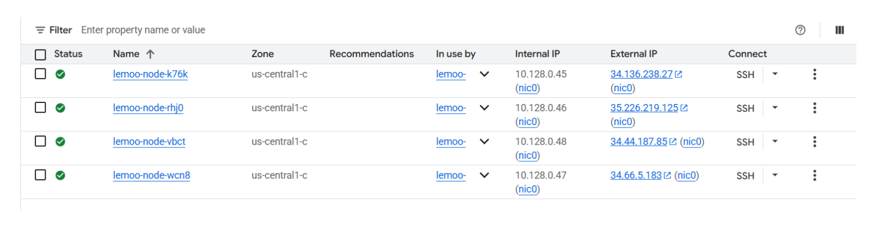 | 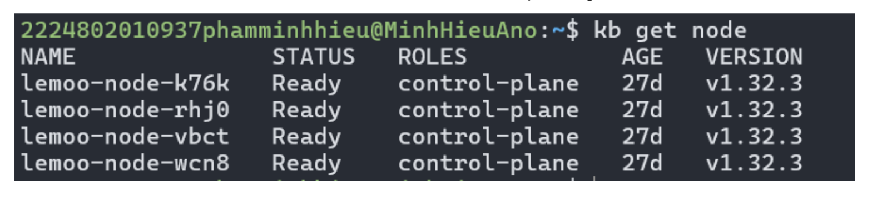 |

| K8s Deployments | Kafka Topics                     |
|---|----------------------------------|
| 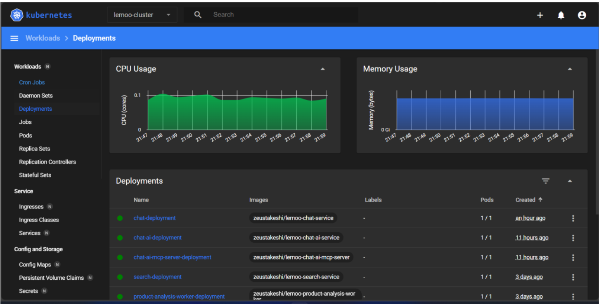 | 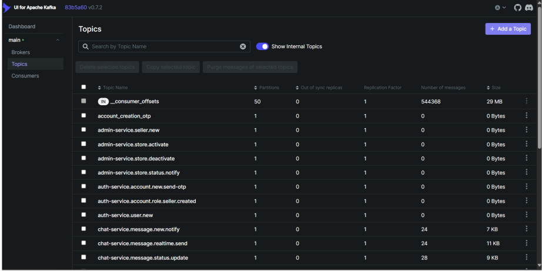 |

**Redis Cache Monitoring**

<!-- INSERT: H�nh 4.5 - Giao di?n qu?n l� Redis qua Redis Insight -->
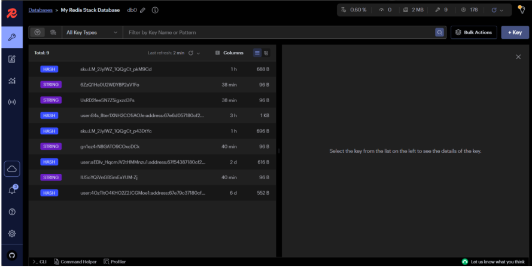
---

## License

This project is licensed under the MIT License ? see the [LICENSE](LICENSE) file for details.

---

  Built with ?? by the Lemoo Team

